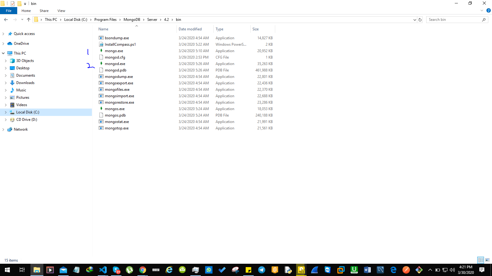
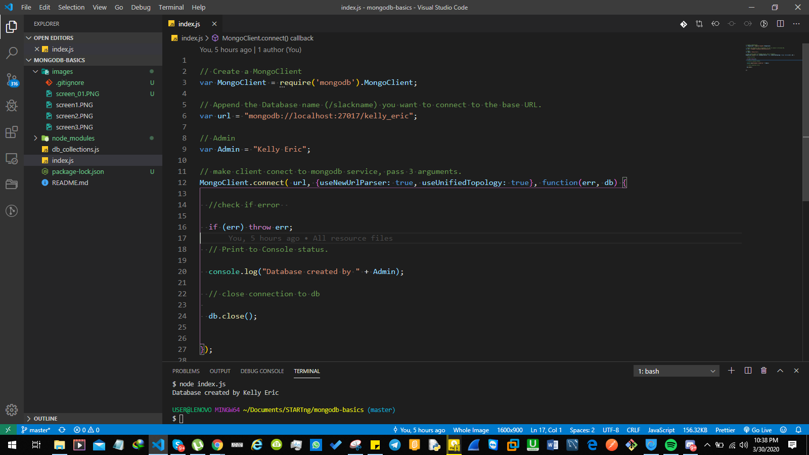
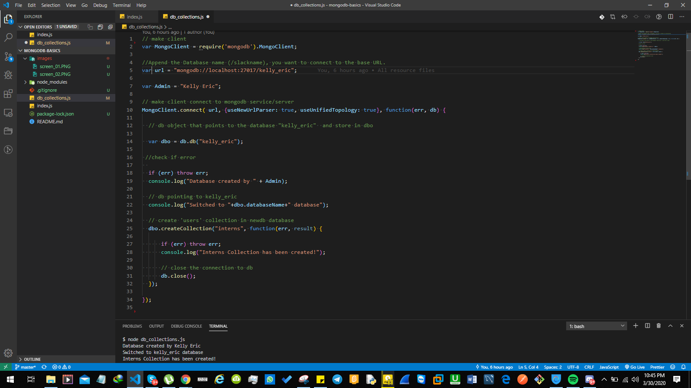

# CONNECTING TO A MONGO DATABASE WITH NODEJS

### Below are screenshots for the expected tasks, refer above for the codebase :point_up:

### TODO:
- [x] Screenshot 1 - Display Mongo.exe and Mongod.exe
- [x] Screenshot 2 - Display Output of Created database with slack username
- [x] Screenshot 3 - Display Collections created named __"interns"__


# Screenshot 1



# Screenshot 2


# Screenshot 3



```javascript
var mongoDb = require("mongo")

```


> All Task done :joy: