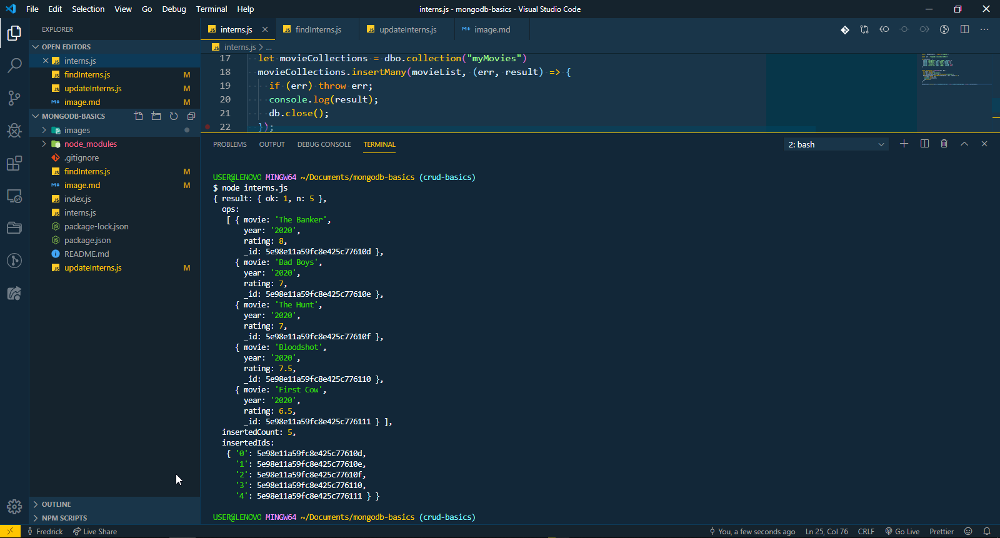
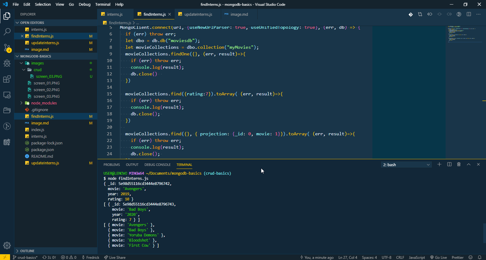
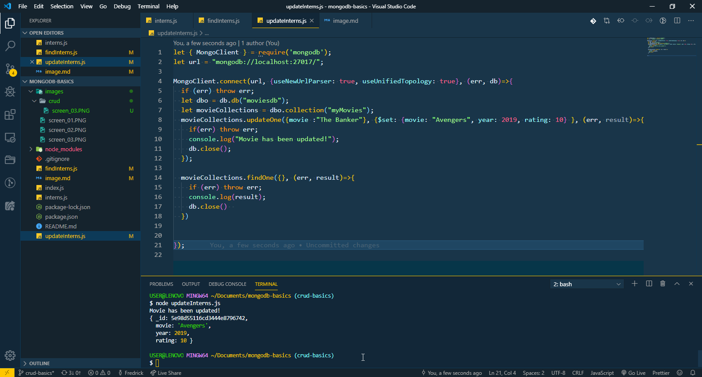

# CONNECTING TO A MONGO DATABASE WITH NODEJS

### Below are screenshots for the expected tasks, refer above for the codebase :point_up:


### TODO:
- [x] Screenshot 1 - Display My movies collections and documents
- [x] Screenshot 2 - Display Output of fileIntern.js file - return a,b,c
- [x] Screenshot 3 - Display Updated Collections


# Screenshot 1



# Screenshot 2


# Screenshot 3



```javascript
var mongoDb = require("mongo")

```


> All Task done :joy:
